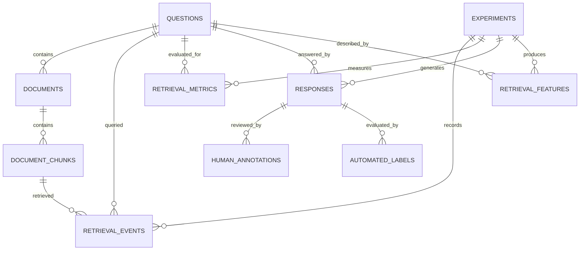

# Experimental database ERD

The schema separates experimental observations from their configuration and
keeps human ground truth independent from automated evaluator outputs. This
allows evaluator versions to be compared without overwriting annotations.
